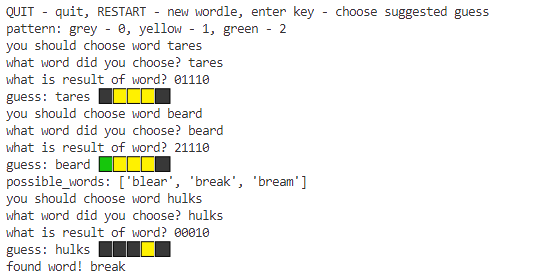

# Wordle Solver
Solve Wordle! 

Inspired by [3Blue1Brown video](https://www.youtube.com/watch?v=v68zYyaEmEA&ab_channel=3Blue1Brown).

Has 100% win rate for the words in Wordle's possible words list (2309 words), average number of rounds is 4.178.

## Playing Game
Run `python3 main.py`. Use suggested word when playing wordle to optimize information gain.

## Simulating Guesses
Can also simulate the guesses and patterns that would appear to find a given word. Since algorithm is deterministic, it would use the same sequence of guesses to arrive at the same solution.

